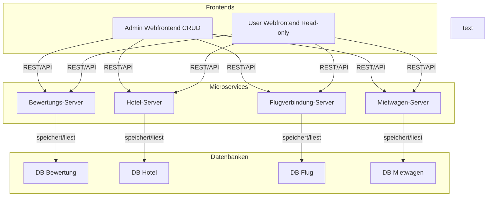
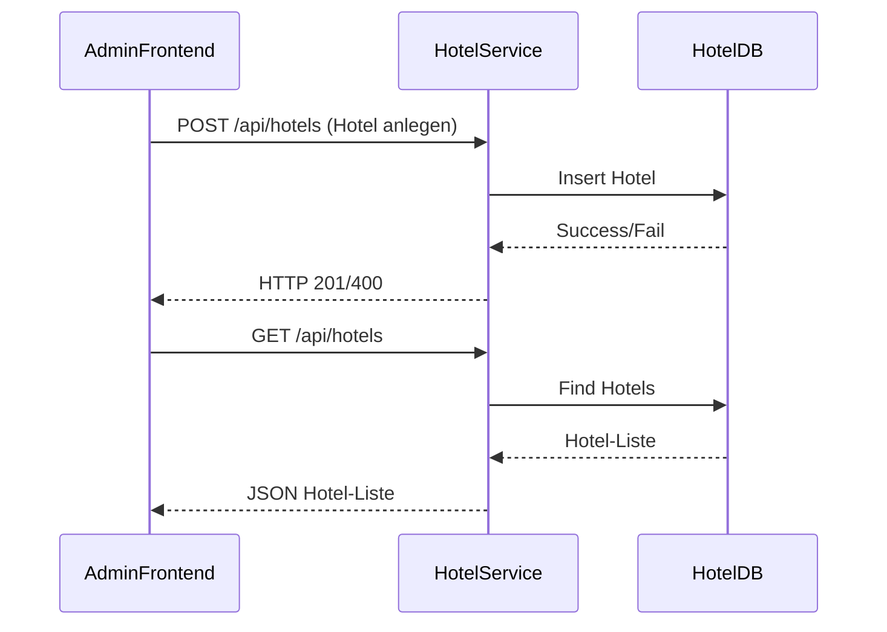
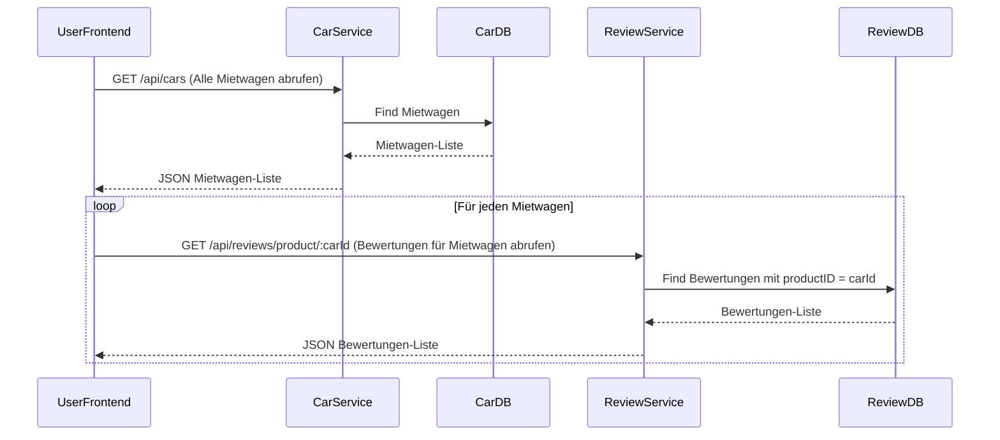

# Architektur

## Inhalt

- [Architekturdiagramm](#architekturdiagramm)
- [Komponenten und Aufgaben](#komponenten-und-aufgaben)
    - [Microservices](#microservices)
    - [Frontends](#frontends)
- [Kommunikationsmuster](#kommunikationsmuster)
- [Vorteile der Microservices-Architektur](#vorteile-der-microservices-architektur)
- [Technologien](#technologien)
- [Rollen und Rechte](#rollen-und-rechte)
- [Beispiel: API-Kommunikation](#beispiel-api-kommunikation)
- [Typische API-Routen (Beispiel Hotel-Service)](#typische-api-routen-beispiel-hotel-service)

---

## Architekturdiagramm

---

## Komponenten und Aufgaben

### Microservices

- **Bewertungs-Server**  
  Verwaltet Bewertungen zu Hotels, Flügen und Mietwagen.
- **Hotel-Server**  
  Verwaltung und Bereitstellung von Hotelinformationen.
- **Flugverbindung-Server**  
  Verwaltung und Bereitstellung von Flugverbindungen.
- **Mietwagen-Server**  
  Verwaltung und Bereitstellung von Mietwagenangeboten.

Jeder Microservice besitzt:
- Eine eigene, unabhängige MongoDB-Datenbank
- Eine REST-API für CRUD-Operationen 

### Frontends

- **Admin Webfrontend**
    - Kann alle CRUD-Operationen (Create, Read, Update, Delete) auf allen Microservices ausführen
    - Kommuniziert direkt mit den APIs der Microservices
    - Bootstrap-basiert (responsive)
- **User Webfrontend**
    - Kann Daten aus allen Microservices lesen (Read-only)
    - Kann Bewertungen zu Dienstleistungen vergeben
    - Kommuniziert direkt mit den APIs der Microservices
    - Bootstrap-basiert (responsive)

---

## Kommunikationsmuster

- **Lose Kopplung:**  
  Die Frontends kennen nur die API-Endpunkte, nicht die interne Implementierung der Microservices.
- **API-basierte Kommunikation:**  
  Alle Interaktionen laufen über HTTP-APIs (REST).
- **Keine direkte DB-Verbindung zwischen Services:**  
  Jeder Microservice verwaltet seine eigene Datenbank. Es findet kein direkter Zugriff auf die Datenbank eines anderen Microservices statt, stattdessen wird der entsprechende Microservice kontaktiert. Es wird ein Datenbankenserver verwendet (Ressourceneffizienz).

---

## Vorteile der Microservices-Architektur

| Vorteil                | Beschreibung                                                                 |
|------------------------|------------------------------------------------------------------------------|
| **Unabhängige Entwicklung** | Jeder Service kann separat entwickelt, getestet und deployt werden.         |
| **Fehlerisolierung**        | Fehler in einem Service betreffen die anderen nicht.                      |
| **Skalierbarkeit**          | Services können unabhängig voneinander skaliert werden.                   |
| **Technologievielfalt**     | Jeder Service kann mit unterschiedlichen Technologien realisiert werden.   |

---

## Technologien

- **Backend:**
    - ExpressJS (Node.js)
    - MongoDB
- **Frontend:**
    - Bootstrap (Responsive Design)
    - JS (für API-Calls und UI-Logik)
- **Containerisierung:**
    - Docker & Docker Compose
    - Nginx als zentraler Reverse Proxy

---

## Rollen und Rechte

- **User:**
    - R: Read
    - C: Create (ausschließlich Bewertungen, nicht Prüfungsanforderung)
- **Admin:**
    - CRUD: Create, Read, Update, Delete

---

## Beispiel: API-Kommunikation

Anlage eines Hotels im Admin Frontend

Anzeige aller Mietwagen im User Frontend (inkl. Abruf zugehöriger Bewertungen)

---

## Typische API-Routen (Beispiel Hotel-Service)

Weitere Details findest du in der [API-Dokumentation](/docs/api-reference.md).

| Methode | Route                | Beschreibung                 |
|---------|----------------------|------------------------------|
| GET     | /api/hotels          | Alle Hotels abrufen          |
| GET     | /api/hotels/:id      | Einzelnes Hotel abrufen      |
| POST    | /api/hotels          | Neues Hotel anlegen          |
| PUT     | /api/hotels/:id      | Hotel aktualisieren          |
| DELETE  | /api/hotels/:id      | Hotel löschen                |

---